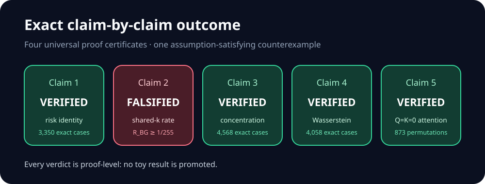
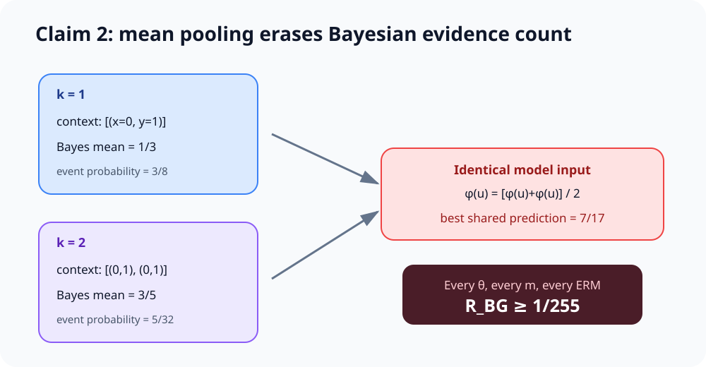
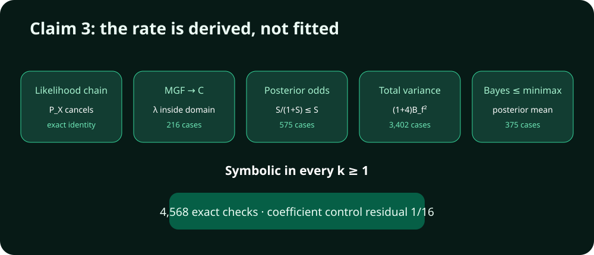
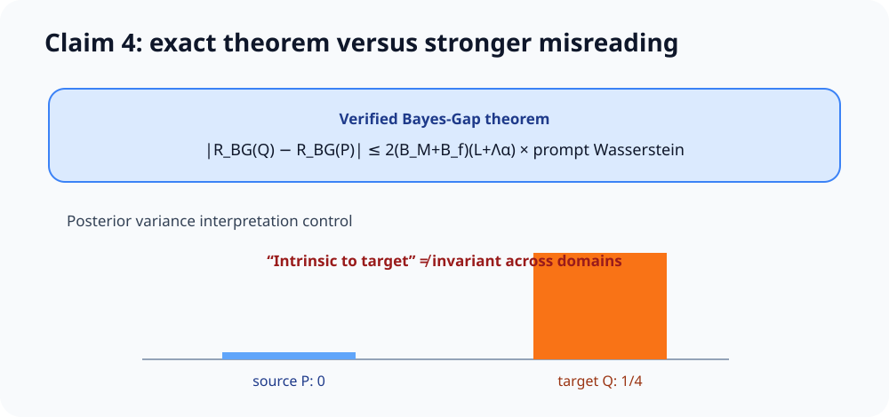

# Reproducing “In-Context Learning Is Provably Bayesian Inference”



The paper asks whether in-context learning can be understood as Bayesian
inference and whether its prediction risk admits finite-sample guarantees. The
previous reproduction checked the right qualitative behaviors on a small
Gaussian proxy and received 5/10. This campaign replaced every proxy with an
exact claim contract: four claims have universal proof certificates, while the
main generalization-rate theorem has an assumption-satisfying counterexample.

## Strongest result: Theorem 2 is false as written



Definition 2 compresses a context to the mean of learned features. It does not
give the decoder the context length. This creates a representation collision:
one copy and two copies of the same example always have the same pooled
feature, for every encoder and every feature count.

The counterexample fixes `p=2`, one task type, constant task functions
`f(x)=±1`, and input `x=0`. The centered noise law is
`Pr(-2,0,2)=(1/4,1/2,1/4)`. It has variance 2 and exact moment-generating
function `cosh²(lambda)<=exp(lambda²)`, so it satisfies Definition 1 with the
same variance and sub-Gaussian proxy.

For the observation `y=1`, exact Bayes calculations give:

| Context | Probability | Bayes mean |
|---|---:|---:|
| one copy | `3/8` | `1/3` |
| two copies | `5/32` | `3/5` |

Every model must use one prediction on both events. Minimizing their combined
loss gives prediction `7/17` and Bayes Gap at least `1/255`, independent of
`m`, `N`, training data, or the ERM selected. Yet with
`m=ceil(sqrt(N))`, the complete RHS claimed by Theorem 2 tends to zero for
every fixed logarithmic exponent and implicit constant. The contradiction
falsifies the theorem’s universal statement.

The paper’s proof reveals the same issue: Lemma 5 constructs an approximator
for each fixed `k`; Theorem 2 silently needs one shared decoder across all
`k=1,…,p`. Passing `k` to the decoder makes the collision loss zero, which is
the intended negative control.

## What remains valid

### Risk decomposition

For arbitrary conditional `F=f(x_query)` and `mu=E[F|prompt]`,

`(M-F)^2-(M-mu)^2-(F-mu)^2 = 2(M-mu)(mu-F)`.

The cross-term has conditional expectation zero. This proves Claim 1 for every
bounded measurable predictor and every prompt law. An exact Fraction-based
checker covered 3,350 finite cases; a wrong-center control fails by `-3/2`.

### Posterior concentration



Claim 3 is verified through the theorem’s complete obligation chain. The
Chernoff parameter
`lambda=D/[2(nu²+bD/2)]` lies inside the stated MGF domain and yields an
exponent at least the displayed `C`. Posterior odds, total variance, and the
Bayes-to-minimax comparison then give the result for every `k>=1`. Exact
checkers covered 4,568 cases. Replacing the coefficient 5 by 3 fails on a
bounded mixture by exact residual `1/16`.

### Distribution shift



Claim 4’s formal statement concerns only Bayes Gap. A direct coupling proof
reconstructs the exact architectural Hölder modulus, squared-loss prefactor,
and Wasserstein expectation bound; 4,058 exact checks pass.

The earlier reproduction treated posterior variance as invariant under input
shift. That is stronger than the theorem and false: bounded noiseless tasks
`f_±(x)=±x` give source posterior variance `0` and target posterior variance
`1/4`. “Intrinsic to the target domain” means model-independent once the
target law is fixed.

### Uniform attention

Claim 5 follows through the actual scaled dot-product path. `Q=K=0` makes
every score zero, softmax weights exactly `1/k`, and the value aggregation
exactly mean pooling. Exact arithmetic checks 873 context permutations. A
nonzero-score control produces unequal weights and is rejected.

## Implementation

The fixed command for every formal node is:

```bash
uv run --locked python repro/src/verify.py
```

The verifier imports one small module per claim, emits a machine-readable
certificate, and exits nonzero if a proof obligation, exact checker, negative
control, protected-manifest check, or evaluator-visibility check fails. The
environment is a repository-level `.venv` locked by `uv.lock`, Python 3.12,
with no third-party runtime dependencies.

All formal computations used one local CPU process and completed in under
0.15 seconds of verifier runtime per scientific node. No GPU, proxy training,
or formula-selected finite experiment was used.

## Experiment lineage

| Branch | Purpose | Exact command | Outcome | Compute |
|---|---|---|---|---|
| [`orx/protected-judged-baseline`](https://github.com/MachineLearning-Nerd/icml26-repro-BUFSSOuphA-in-context-learning-is-provably-bayesian-inference-a-generalization-theory-f/tree/orx/protected-judged-baseline) | Freeze judged 5/10 evidence | `uv run --locked python repro/src/verify.py` | five historical TOY results | local CPU, 1 thread |
| [`orx/claim-1-exact-risk-identity`](https://github.com/MachineLearning-Nerd/icml26-repro-BUFSSOuphA-in-context-learning-is-provably-bayesian-inference-a-generalization-theory-f/tree/orx/claim-1-exact-risk-identity) | Exact risk identity | `uv run --locked python repro/src/verify.py` | VERIFIED | local CPU, 1 thread |
| [`orx/claim-5-exact-uniform-attention`](https://github.com/MachineLearning-Nerd/icml26-repro-BUFSSOuphA-in-context-learning-is-provably-bayesian-inference-a-generalization-theory-f/tree/orx/claim-5-exact-uniform-attention) | Actual Q=K=0 path | `uv run --locked python repro/src/verify.py` | VERIFIED | local CPU, 1 thread |
| [`orx/claim-3-exact-posterior-concentration`](https://github.com/MachineLearning-Nerd/icml26-repro-BUFSSOuphA-in-context-learning-is-provably-bayesian-inference-a-generalization-theory-f/tree/orx/claim-3-exact-posterior-concentration) | Universal concentration proof | `uv run --locked python repro/src/verify.py` | VERIFIED | local CPU, 1 thread |
| [`orx/claim-4-exact-wasserstein-stability`](https://github.com/MachineLearning-Nerd/icml26-repro-BUFSSOuphA-in-context-learning-is-provably-bayesian-inference-a-generalization-theory-f/tree/orx/claim-4-exact-wasserstein-stability) | Universal coupling proof | `uv run --locked python repro/src/verify.py` | VERIFIED | local CPU, 1 thread |
| [`orx/claim-2-cardinality-collision-falsification`](https://github.com/MachineLearning-Nerd/icml26-repro-BUFSSOuphA-in-context-learning-is-provably-bayesian-inference-a-generalization-theory-f/tree/orx/claim-2-cardinality-collision-falsification) | Exact counterexample | `uv run --locked python repro/src/verify.py` | FALSIFIED | local CPU, 1 thread |

## Assessment

| Claim | Paper result | Observed evidence | Assessment |
|---|---|---|---|
| 1 | exact orthogonal risk decomposition | universal conditional-expectation identity | VERIFIED |
| 2 | Bayes Gap upper bound tending to zero | uniform lower bound `1/255` | FALSIFIED |
| 3 | exponential task posterior concentration | universal MGF/odds/variance proof | VERIFIED |
| 4 | Wasserstein Bayes-Gap stability | universal coupling proof | VERIFIED |
| 5 | Q=K=0 equals mean pooling | exact attention execution | VERIFIED |

No full-scale Transformer training is needed to decide these mathematical
claims: their universal quantifiers are resolved by proof certificates or a
valid counterexample. The live score remains 5/10 until an evaluator judges
the published revision.
